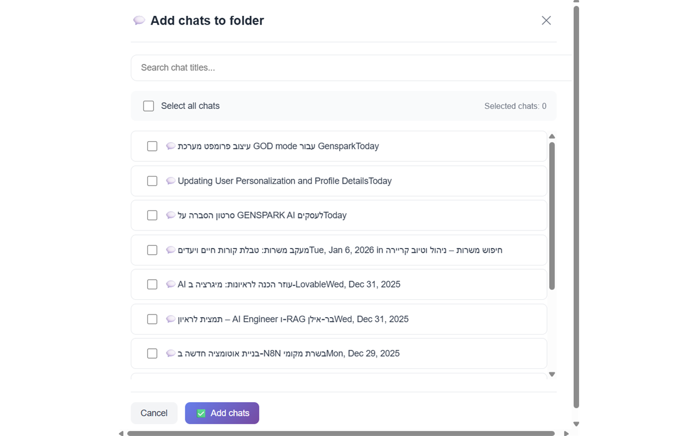
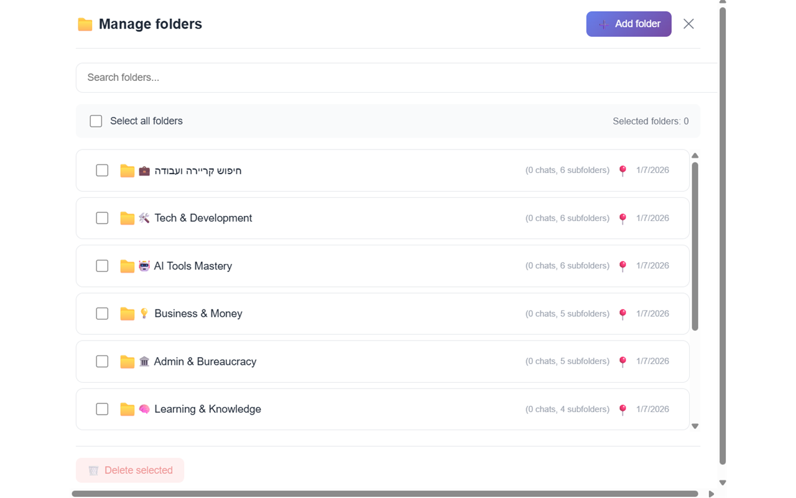

# Genspark Conversation Manager

תוסף כרום לניהול שיחות Genspark AI עם יכולות ארגון מתקדמות.

---

## גרסה 3.0 (בבדיקה)

> **הערה:** גרסה 3.0 הוגשה לחנות כרום. הקוד ישוחרר לאחר האישור.

### תכונות חדשות

- **מנהל תיקיות** - ארגון שיחות בתיקיות מותאמות אישית עם אינטגרציה לסרגל הצד
- **תמיכה מלאה בשפות** - תרגום מלא לעברית ואנגלית (200+ מחרוזות)
- **הורדה מהירה ומלאה** - בחירה בין מטא-דאטה בלבד או תוכן מלא
- **פעולות מרובות** - בחירה וניהול של מספר שיחות בו-זמנית
- **תמיכה משופרת ב-RTL** - תמיכה טובה יותר בשפות מימין לשמאל

### צילומי מסך

---

## תכונות

- הורדת שיחות כ-JSON או TXT
- חיפוש בשיחה הנוכחית או בכל השמורות
- שמירת שיחות מקומית עם Chrome storage
- ארגון במערכת תיקיות
- ממשק מלא בעברית ואנגלית
- ייצוא ZIP להורדות מרובות

## התקנה

1. הורדה מ-[Chrome Web Store](https://chromewebstore.google.com/) (ממתין לאישור v3.0)
2. או טעינה ידנית מתיקיית `v2.8-FINAL/` לפיתוח

## שימוש

1. נווט ל-[genspark.ai](https://genspark.ai)
2. לחץ על אייקון התוסף לפתיחת הפופאפ
3. השתמש בכפתור התיקיות בסרגל הצד לארגון שיחות
4. הורד, חפש או שמור לפי הצורך

## רישיון

MIT
